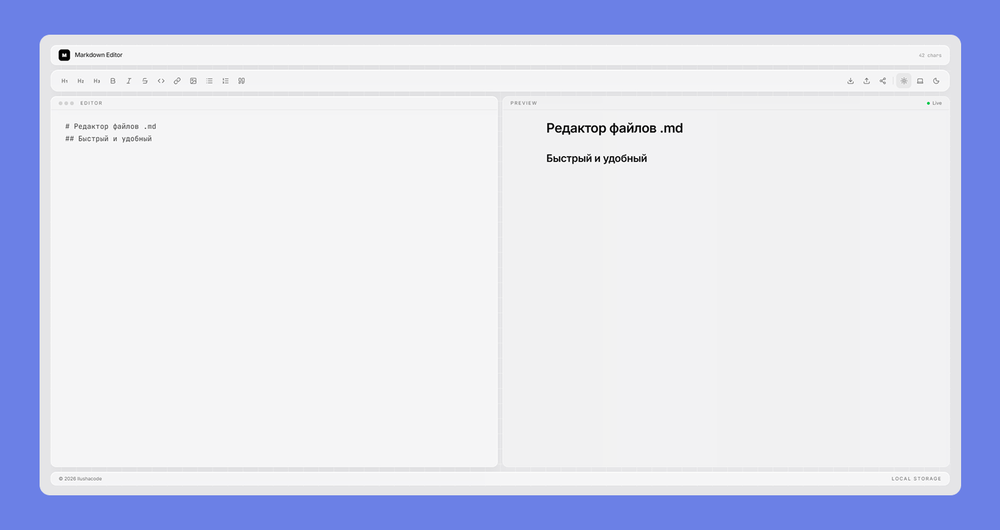

Современный **онлайн редактор Markdown** с живым предпросмотром, стеклянным минималистичным интерфейсом и поддержкой светлой/тёмной темы.

🌐 **Живая версия:** [ilushacode.github.io/md-editor](https://ilushacode.github.io/md-editor/)


## ✨ Возможности

- 📝 **Живой предпросмотр** — изменения видны мгновенно
- 🌗 **Три темы** — светлая, тёмная и системная
- 💾 **Автосохранение** — последний документ хранится локально
- 🔗 **Шаринг через URL** — содержимое кодируется в hash-ссылке
- ↩️ **История отмен** — `Ctrl+Z` / `Ctrl+Y`
- 📥 **Импорт и экспорт** — загрузка и скачивание `.md` файлов
- ⌨️ **Панель форматирования** — заголовки, списки, цитаты, код, ссылки
- 🧪 **Покрыто тестами** — 38 юнит- и интеграционных тестов
- 🚀 **Автодеплой** — CI/CD через GitHub Actions


## 🛠️ Стек

- **Сборка** — Vite
- **UI** — React 18 + TypeScript
- **Стили** — Tailwind CSS v4
- **Состояние** — Zustand
- **Markdown** — react-markdown + remark-gfm + remark-breaks
- **Иконки** — Lucide
- **Тесты** — Vitest + Testing Library
- **CI/CD** — GitHub Actions + GitHub Pages


## 🚀 Локальный запуск

```bash
npm install
npm run dev
```


## 🧪 Тесты

```bash
npm test          # watch-режим
npm run test:run  # однократный прогон
```


## 📦 Деплой

Пуш в `main` автоматически собирает проект и публикует его в **GitHub Pages** через **GitHub Actions**.


## ⌨️ Горячие клавиши

| Комбинация | Действие |
|---|---|
| `Ctrl/Cmd + Z` | Отменить |
| `Ctrl/Cmd + Y` или `Ctrl/Cmd + Shift + Z` | Повторить |


## 📄 Лицензия

MIT © Ilushacode